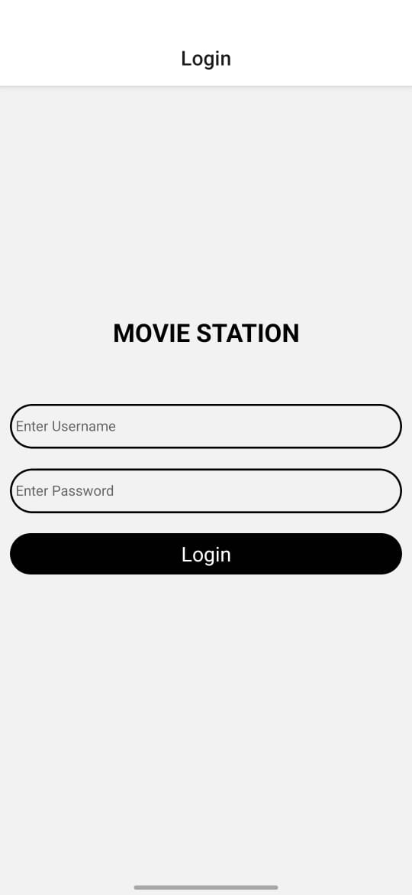

# 🎬 Movie Explorer App

A cross-platform mobile app built with **React Native**, **JavaScript**, and **Expo** that allows users to explore and search for movies using the **OMDb API**.

---

## 🚀 Features

- 🔍 Real-time movie search using the OMDb API  
- 🔐 User login (with basic auth or Firebase/Auth integration placeholder)  
- ❤️ Favorites management – add/remove movies to your personal list  
- 🖼️ Dynamic routing – click movie posters to view detailed info  
- 📱 Responsive UI and smooth animations across Android and iOS  
- ⚡ Seamless navigation using React Navigation

---

## 📸 Screenshots

| Login Page | Home Screen | Search Results | Movie Details | Favorites Page |
|------------|-------------|----------------|----------------|----------------|
|  |  |  |  |  |


---

## 🎥 Demo Video

<a href="https://www.instagram.com/reel/DM_EBd7B4bb">
  
</a>


---


## 🔧 Get started

1. Install dependencies

   ```bash
   npm install
   ```

2. Start the app

   ```bash
   npx expo start
   ```

In the output, you'll find options to open the app in a

- [development build](https://docs.expo.dev/develop/development-builds/introduction/)
- [Android emulator](https://docs.expo.dev/workflow/android-studio-emulator/)
- [iOS simulator](https://docs.expo.dev/workflow/ios-simulator/)
- [Expo Go](https://expo.dev/go), a limited sandbox for trying out app development with Expo

You can start developing by editing the files inside the **app** directory. This project uses [file-based routing](https://docs.expo.dev/router/introduction).

## Get a fresh project

When you're ready, run:

```bash
npm run reset-project
```

This command will move the starter code to the **app-example** directory and create a blank **app** directory where you can start developing.

## Learn more

To learn more about developing your project with Expo, look at the following resources:

- [Expo documentation](https://docs.expo.dev/): Learn fundamentals, or go into advanced topics with our [guides](https://docs.expo.dev/guides).
- [Learn Expo tutorial](https://docs.expo.dev/tutorial/introduction/): Follow a step-by-step tutorial where you'll create a project that runs on Android, iOS, and the web.

## Join the community

Join our community of developers creating universal apps.

- [Expo on GitHub](https://github.com/expo/expo): View our open source platform and contribute.
- [Discord community](https://chat.expo.dev): Chat with Expo users and ask questions.
